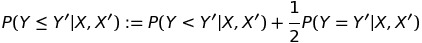
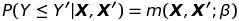
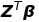
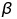
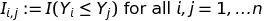
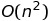

# Big Data application: PIM

## Short introduction
The following is a very dense summary of the class of Probabilistic Index Models used in this project. We refer to Thas et al. (2012) for more information.

### Probabilistic Index
The Probabilistic Index is defined as

If (Y,**X**) and (Y',**X'**) are i.i.d, then a Probabilistic Index Model is defined as:

m(.) is here a function with range [0,1] and some smoothness condition. This function is restricted so that it is related to a linear predictor  where **Z** is a *p*-dimensional vector with elements that may depend on **X** and **X'** and *p* equal to the amount of predictors.

### Problem
The goal of any regression approach is to estimate the  parameters. For the PIM model, this quickly becomes computationally too demanding. To estimate these paremeters, we need to use the set of *pseudo-observations* . Given some contraints which we do not discus here, the set of *pseudo-observations* increases quadratic in its limiting behavior with *n*. That is the set of indices = .

### Goal
The goal of this project is to fit the PIM to a large dataset. We will try to accomplish this by subsampling from the set of *pseudo-observations*. 
Though the term Big Data is usually reserved for a broader setting in which data storage, distribution, volume, velocity, etc. play an important role.
In our setting, we do not need a massive dataset as it is already nearly imposible to fit a PIM when N > 100.000. Hence, we will work with the term **large datasets** to restrict our focus.

## Project structure
* 1_Scripts: contains **R** scripts.
* 2_Reports: contains a selection of reports (in the form of R notebooks using RStudio/Jupyter).

# References
[[1]](http://citeseerx.ist.psu.edu/viewdoc/download?doi=10.1.1.448.9892&rep=rep1&type=pdf) Thas, O., De Neve, J., Clement, L., and Ottoy, J.P. (2012) Probabilistic index models (with discussion). *Journal of the Royal Statistical Society* - Series B, 74:623-671.